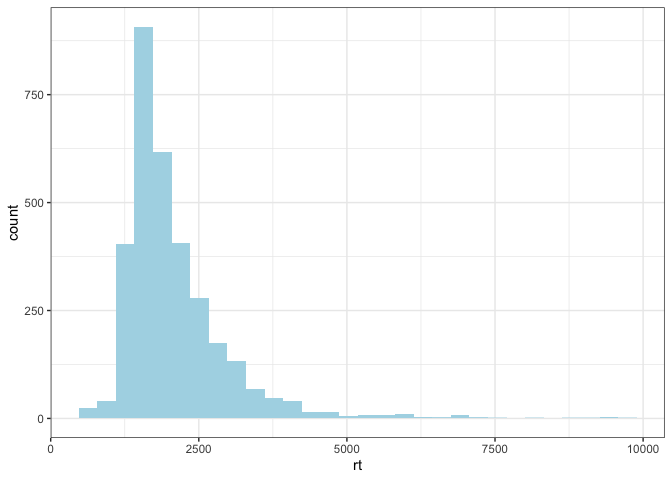
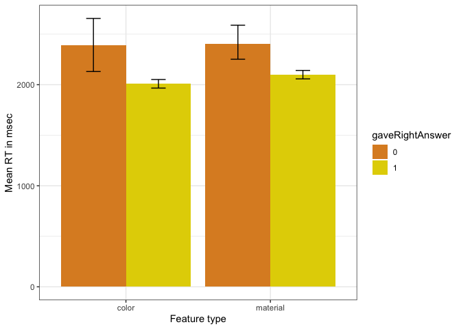
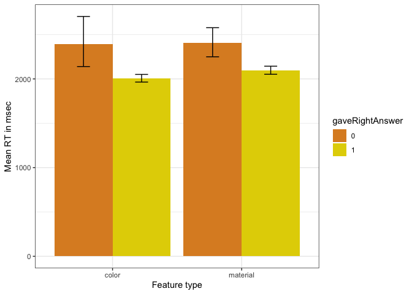
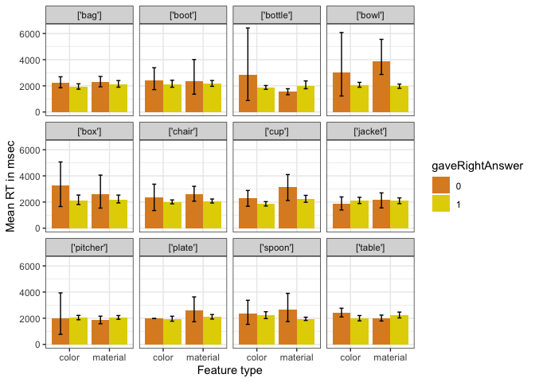

Perceptual Difficulty - Perceptibility
================

**Stimuli check**

    ##        
    ##            color material
    ##   'no'   0    81       81
    ##   'yes'  0    81       81

**Fastest and slowest response
    times**

    ##  [1] 530 547 555 558 560 586 590 591 608 610

    ##  [1]   9430   9514   9638  10512  11593  13863  16517  22654  29143  37743
    ## [11]  40953  66284  71226  77544 133226

**RT distribution: (after excluding: rt\>10000 (12
    responses))**

    ## `stat_bin()` using `bins = 30`. Pick better value with `binwidth`.

<!-- --> **RTs to color
and material features (everything collapsed)**
<!-- -->

**RTs to color and material features (only expected YES cases)**
<!-- -->

**By item** <!-- --> **By
item (only expected YES cases)**
<!-- --> **By image**

**By image (only expected YES cases)**
