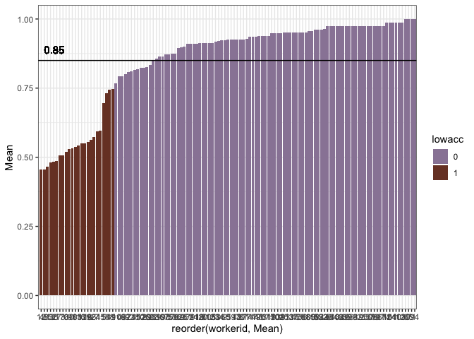
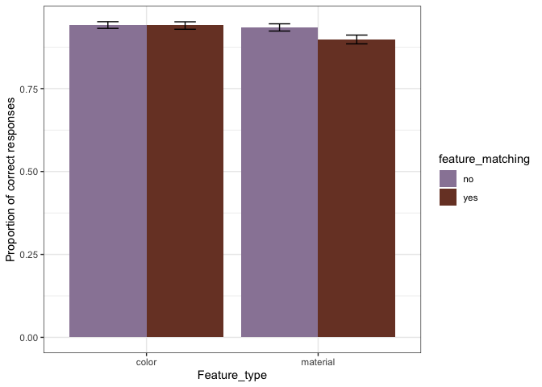
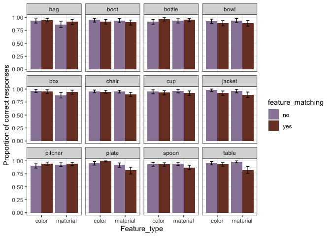
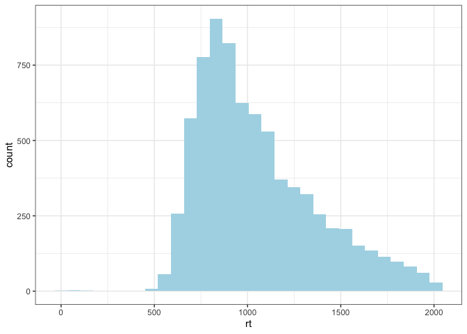
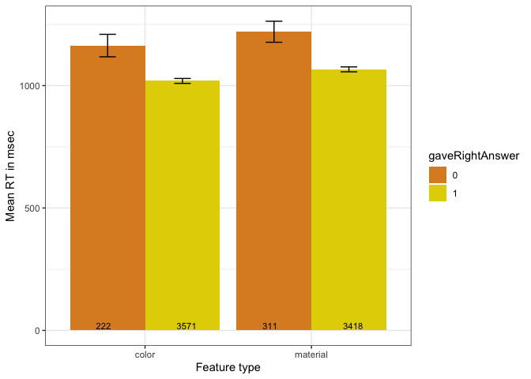
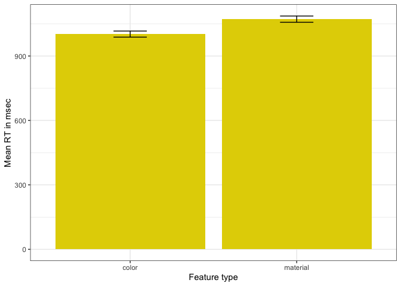
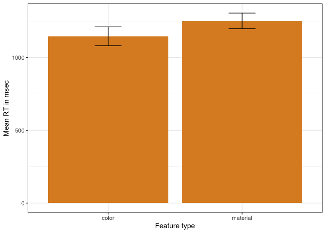
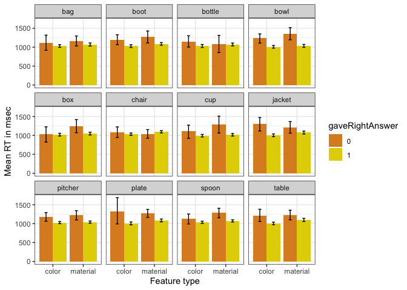
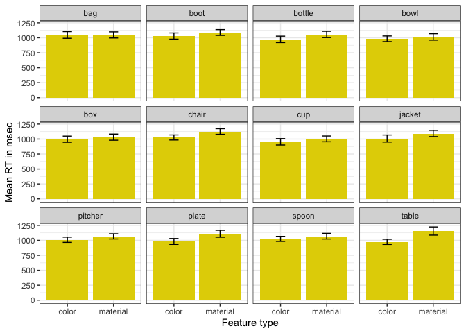
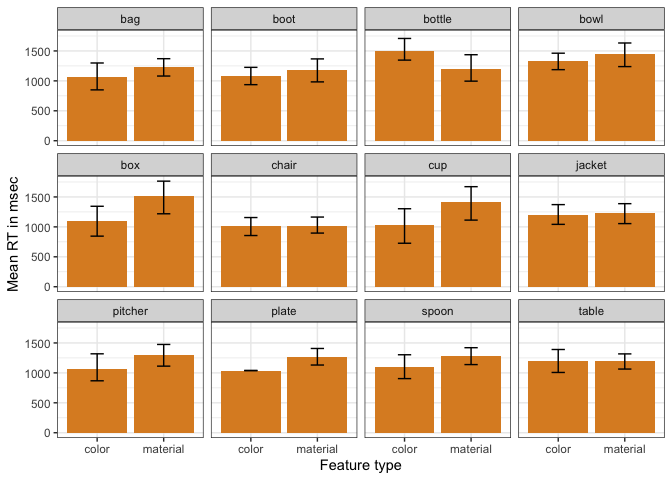

Perceptual Difficulty - Randomized and Timed Perceptibility
================

**Stimuli check**

    ##      
    ##       color material
    ##   no     81       81
    ##   yes    81       81

**Exclusions** Participants whose native language is not English are
excluded

    ##   workerid language
    ## 1       57  Chinese
    ## 2       82         
    ## 3       90  Spanish

Participants with accuracy lower than 75% are excluded (11 participants)
<!-- -->

    ## # A tibble: 24 x 7
    ##    workerid  Mean CILow CIHigh  YMin  YMax lowacc
    ##       <int> <dbl> <dbl>  <dbl> <dbl> <dbl> <chr> 
    ##  1        0 0.519 0.111  0.111 0.407 0.630 1     
    ##  2        1 0.746 0.104  0.104 0.642 0.851 1     
    ##  3        3 0.506 0.101  0.114 0.405 0.620 1     
    ##  4        6 0.573 0.12   0.12  0.453 0.693 1     
    ##  5        7 0.593 0.111  0.111 0.481 0.704 1     
    ##  6       12 0.457 0.111  0.111 0.346 0.568 1     
    ##  7       13 0.481 0.114  0.102 0.367 0.583 1     
    ##  8       16 0.556 0.127  0.112 0.429 0.667 1     
    ##  9       17 0.506 0.111  0.111 0.395 0.617 1     
    ## 10       27 0.488 0.112  0.112 0.375 0.6   1     
    ## # … with 14 more rows

**Proportion of correct responses**

<!-- -->

**By item - Proportion of correct responses**

<!-- -->

**By unique item - Proportion of correct responses to matching/not
matching features** (plot in graphs/)

**RT Distribution** Late responses
    removed

    ## `stat_bin()` using `bins = 30`. Pick better value with `binwidth`.

<!-- -->

**RTs to color and material features (everything collapsed)**

<!-- -->

**RTs to color and material features (only correct responses to matching
features)**

<!-- -->

**RTs to color and material features (only incorrect responses to
matching features)**

<!-- -->

**By item**

<!-- -->

**By item (only correct responses to matching features)**

<!-- -->

**By item (only incorrect responses to matching features)**

<!-- -->

**By image** (plot in graphs/)

**By image (only correct responses to matching features)** (plot in
graphs/)

**By image (only incorrect responses to matching features)** (plot in
graphs/)
