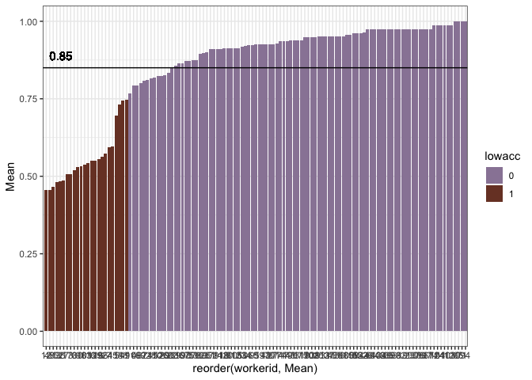

Perceptual Difficulty - Randomized and Timed Perceptibility2 (difficulty
analysis)
================

**Stimuli check**

    ##      
    ##       color material
    ##   no     81       81
    ##   yes    81       81

**Exclusions** Participants whose native language is not English are
excluded

    ##   workerid language
    ## 1       57  Chinese
    ## 2       82         
    ## 3       90  Spanish

Participants with accuracy lower than 75% are excluded (29 participants)
<!-- -->

    ## # A tibble: 24 x 7
    ##    workerid  Mean  CILow CIHigh  YMin  YMax lowacc
    ##       <int> <dbl>  <dbl>  <dbl> <dbl> <dbl> <chr> 
    ##  1        0 0.519 0.0988 0.111  0.420 0.630 1     
    ##  2        1 0.746 0.104  0.104  0.642 0.851 1     
    ##  3        3 0.506 0.114  0.114  0.392 0.620 1     
    ##  4        6 0.573 0.12   0.107  0.453 0.68  1     
    ##  5        7 0.593 0.0988 0.0991 0.494 0.692 1     
    ##  6       12 0.457 0.111  0.111  0.346 0.568 1     
    ##  7       13 0.481 0.102  0.101  0.379 0.582 1     
    ##  8       16 0.556 0.127  0.127  0.429 0.683 1     
    ##  9       17 0.506 0.111  0.111  0.395 0.617 1     
    ## 10       27 0.488 0.112  0.1    0.375 0.588 1     
    ## # … with 14 more rows

# By response times

**Regardless of response correctness and feature matching**

    ## # A tibble: 15 x 7
    ##    label                          condition     Mean CILow CIHigh count group
    ##    <fct>                          <chr>        <dbl> <dbl>  <dbl> <int> <chr>
    ##  1 table_metal_blue               material yes 1266.  148.   161.    22 rt   
    ##  2 table_metal_green              material yes 1253.  162.   176.    20 rt   
    ##  3 chair_metal_purple             material yes 1244.  123.   124.    25 rt   
    ##  4 box_wood_blue                  material yes 1212.  136.   158.    23 rt   
    ##  5 plate_plastic_pink             material yes 1211.  123.   146.    20 rt   
    ##  6 table_metal_silver_original    material yes 1204.  122.   116.    20 rt   
    ##  7 table_wood_green               material yes 1201.  106.   117.    26 rt   
    ##  8 chair_metal_green              material yes 1187.  134.   126.    20 rt   
    ##  9 jacket_leather_green           material yes 1187.  126.   135.    24 rt   
    ## 10 bottle_glass_blue              material yes 1185.  124.   133.    23 rt   
    ## 11 pitcher_metal_blue             material yes 1185.  165.   161.    22 rt   
    ## 12 spoon_wood_green               material yes 1179.  138.   133.    24 rt   
    ## 13 plate_paper_blue               material no  1177.  126.   138.    25 rt   
    ## 14 boot_leather_green             material yes 1174.  129.   129.    19 rt   
    ## 15 pitcher_plastic_white_original material yes 1174.  125.   117.    20 rt

    ## # A tibble: 15 x 7
    ##    label                        condition     Mean CILow CIHigh count group
    ##    <fct>                        <chr>        <dbl> <dbl>  <dbl> <int> <chr>
    ##  1 plate_paper_blue             color yes     943. 100.   114.     25 rt   
    ##  2 table_metal_blue             color yes     941.  96.1   98.0    26 rt   
    ##  3 box_cardboard_brown_original color yes     941.  90.2  100.     26 rt   
    ##  4 table_wood_green             color no      940.  91.4   93.3    20 rt   
    ##  5 table_metal_green            color yes     938.  76.8   72.9    20 rt   
    ##  6 cup_plastic_green            color no      932.  72.5   79.8    25 rt   
    ##  7 chair_plastic_blue_original  color yes     930.  84.6   87.8    20 rt   
    ##  8 table_wood_brown_original    material yes  928. 103.   101.     25 rt   
    ##  9 spoon_metal_green            color yes     924.  95.5  103.     25 rt   
    ## 10 jacket_denim_purple          color yes     922.  85.2   84.8    20 rt   
    ## 11 pitcher_metal_blue           color yes     922   92.5  108.     20 rt   
    ## 12 cup_plastic_blue             material yes  918.  81.4   90.6    26 rt   
    ## 13 table_wood_brown_original    color yes     917.  75.4   88.1    24 rt   
    ## 14 cup_plastic_green            color yes     911. 117.   148.     20 rt   
    ## 15 plate_plastic_blue_original  color yes     875.  93.7  109.     24 rt

**Only correct responses, regardless of feature matching**

    ## # A tibble: 15 x 7
    ##    label                       condition     Mean CILow CIHigh count group     
    ##    <fct>                       <chr>        <dbl> <dbl>  <dbl> <int> <chr>     
    ##  1 table_metal_green           material yes 1316.  208.   223.    12 correct_rt
    ##  2 table_metal_blue            material yes 1305.  206.   199.    14 correct_rt
    ##  3 chair_metal_purple          material yes 1282.  154.   146.    19 correct_rt
    ##  4 table_wood_green            material yes 1206.  121.   119.    23 correct_rt
    ##  5 bottle_glass_clear_original color no     1190.  120.   143.    22 correct_rt
    ##  6 table_metal_silver_original material yes 1185.  163.   160.    15 correct_rt
    ##  7 jacket_leather_purple       material yes 1185.  182.   192.    17 correct_rt
    ##  8 chair_metal_green           material yes 1181.  141.   133.    19 correct_rt
    ##  9 boot_leather_green          material yes 1174.  124.   135.    19 correct_rt
    ## 10 chair_metal_silver_original material yes 1165.  143.   155.    24 correct_rt
    ## 11 boot_leather_black_original material no  1164.  120.   133.    24 correct_rt
    ## 12 spoon_metal_green           material yes 1161.  171.   178.    18 correct_rt
    ## 13 spoon_wood_blue             color no     1160.  169.   169.    21 correct_rt
    ## 14 chair_wood_purple           material yes 1157.  168.   157.    21 correct_rt
    ## 15 table_wood_blue             material yes 1156.  146.   152.    25 correct_rt

    ## # A tibble: 15 x 7
    ##    label                       condition     Mean CILow CIHigh count group     
    ##    <fct>                       <chr>        <dbl> <dbl>  <dbl> <int> <chr>     
    ##  1 box_wood_brown_original     material yes  936   97.3  110.     23 correct_rt
    ##  2 bottle_plastic_green        color yes     935. 102.   116.     18 correct_rt
    ##  3 bowl_metal_silver_original  material yes  934. 102.   121.     22 correct_rt
    ##  4 cup_plastic_green           color no      932.  81.5   85.9    25 correct_rt
    ##  5 table_wood_brown_original   material yes  928.  93.4  102.     25 correct_rt
    ##  6 jacket_denim_purple         color yes     922.  85.1   81.3    20 correct_rt
    ##  7 table_metal_blue            color yes     922.  87.8   93.5    25 correct_rt
    ##  8 cup_plastic_blue            material yes  918.  73.7   88.8    26 correct_rt
    ##  9 cup_plastic_clear_original  color yes     917. 103.   113.     21 correct_rt
    ## 10 pitcher_metal_blue          color yes     915.  90.9  104.     19 correct_rt
    ## 11 cup_plastic_green           color yes     911. 115.   144.     20 correct_rt
    ## 12 bottle_glass_green          color yes     903.  78.7   87.4    19 correct_rt
    ## 13 chair_plastic_blue_original color yes     890.  75.3   75.6    18 correct_rt
    ## 14 table_wood_brown_original   color yes     876.  62.5   68.5    22 correct_rt
    ## 15 plate_plastic_blue_original color yes     875.  91.9  102.     24 correct_rt

**Only correct responses, only matching features**

    ## # A tibble: 15 x 7
    ##    label                   condition    Mean CILow CIHigh count group           
    ##    <fct>                   <chr>       <dbl> <dbl>  <dbl> <int> <chr>           
    ##  1 table_metal_green       material y… 1316. 213.   212.     12 correct_matchin…
    ##  2 table_metal_blue        material y… 1305. 204.   200.     14 correct_matchin…
    ##  3 chair_metal_purple      material y… 1282. 133.   149.     19 correct_matchin…
    ##  4 table_wood_green        material y… 1206. 119.   120.     23 correct_matchin…
    ##  5 table_metal_silver_ori… material y… 1185. 155.   156.     15 correct_matchin…
    ##  6 jacket_leather_purple   material y… 1185. 188.   179.     17 correct_matchin…
    ##  7 chair_metal_green       material y… 1181. 129.   144.     19 correct_matchin…
    ##  8 boot_leather_green      material y… 1174. 126.   126.     19 correct_matchin…
    ##  9 chair_metal_silver_ori… material y… 1165. 152.   170.     24 correct_matchin…
    ## 10 spoon_metal_green       material y… 1161. 167.   179.     18 correct_matchin…
    ## 11 chair_wood_purple       material y… 1157. 153.   171.     21 correct_matchin…
    ## 12 table_wood_blue         material y… 1156. 154.   149.     25 correct_matchin…
    ## 13 plate_paper_blue        material y… 1149. 153.   157.     16 correct_matchin…
    ## 14 bottle_glass_blue       material y… 1147. 133.   125.     21 correct_matchin…
    ## 15 jacket_denim_green      material y… 1146.  87.4   89.5    17 correct_matchin…

    ## # A tibble: 15 x 7
    ##    label                   condition     Mean CILow CIHigh count group          
    ##    <fct>                   <chr>        <dbl> <dbl>  <dbl> <int> <chr>          
    ##  1 box_cardboard_brown_or… material yes  936.  97.8   99.4    23 correct_matchi…
    ##  2 box_wood_brown_original material yes  936   93.6  109.     23 correct_matchi…
    ##  3 bottle_plastic_green    color yes     935. 100.   108.     18 correct_matchi…
    ##  4 bowl_metal_silver_orig… material yes  934. 101.   122.     22 correct_matchi…
    ##  5 table_wood_brown_origi… material yes  928.  98.2  102.     25 correct_matchi…
    ##  6 jacket_denim_purple     color yes     922.  83.9   84.4    20 correct_matchi…
    ##  7 table_metal_blue        color yes     922.  88.6  102.     25 correct_matchi…
    ##  8 cup_plastic_blue        material yes  918.  70.4   91.2    26 correct_matchi…
    ##  9 cup_plastic_clear_orig… color yes     917. 105.   121.     21 correct_matchi…
    ## 10 pitcher_metal_blue      color yes     915.  94.3  104.     19 correct_matchi…
    ## 11 cup_plastic_green       color yes     911. 113.   130.     20 correct_matchi…
    ## 12 bottle_glass_green      color yes     903.  80.8   84.7    19 correct_matchi…
    ## 13 chair_plastic_blue_ori… color yes     890.  72.7   75.6    18 correct_matchi…
    ## 14 table_wood_brown_origi… color yes     876.  62.7   68.5    22 correct_matchi…
    ## 15 plate_plastic_blue_ori… color yes     875.  99.6  105.     24 correct_matchi…

**Only correct responses, only not matching features**

    ## # A tibble: 15 x 7
    ##    label                  condition    Mean CILow CIHigh count group            
    ##    <fct>                  <chr>       <dbl> <dbl>  <dbl> <int> <chr>            
    ##  1 bottle_glass_clear_or… color no    1190.  131.   131.    22 correct_notmatch…
    ##  2 boot_leather_black_or… material no 1164.  123.   134.    24 correct_notmatch…
    ##  3 spoon_wood_blue        color no    1160.  152.   177.    21 correct_notmatch…
    ##  4 plate_paper_blue       material no 1155.  127.   142.    23 correct_notmatch…
    ##  5 boot_leather_brown     color no    1150.  140.   159.    25 correct_notmatch…
    ##  6 bottle_glass_green     material no 1146.  126.   143.    22 correct_notmatch…
    ##  7 chair_metal_green      color no    1146.  143.   160.    25 correct_notmatch…
    ##  8 spoon_wood_green       material no 1144.  142.   149.    22 correct_notmatch…
    ##  9 table_wood_brown_orig… color no    1140.  142.   163.    23 correct_notmatch…
    ## 10 bottle_glass_green     color no    1137.  122.   134.    24 correct_notmatch…
    ## 11 bag_paper_brown_origi… material no 1135.  118.   137.    25 correct_notmatch…
    ## 12 cup_metal_green        color no    1131.  150.   148.    24 correct_notmatch…
    ## 13 boot_leather_green     material no 1126.  120.   130.    26 correct_notmatch…
    ## 14 jacket_denim_green     material no 1123.  129.   140.    27 correct_notmatch…
    ## 15 plate_paper_white_ori… material no 1122.  122.   119.    26 correct_notmatch…

    ## # A tibble: 15 x 7
    ##    label                   condition    Mean CILow CIHigh count group           
    ##    <fct>                   <chr>       <dbl> <dbl>  <dbl> <int> <chr>           
    ##  1 pitcher_glass_blue      material no  979.  97.4   84.2    17 correct_notmatc…
    ##  2 pitcher_plastic_white_… material no  978. 111.   133.     24 correct_notmatc…
    ##  3 chair_wood_brown_origi… color no     977. 103.   117.     20 correct_notmatc…
    ##  4 chair_plastic_blue_ori… color no     972. 105.   118.     24 correct_notmatc…
    ##  5 jacket_denim_purple     material no  968. 125.   135.     22 correct_notmatc…
    ##  6 cup_metal_silver_origi… color no     966  102.   116.     22 correct_notmatc…
    ##  7 jacket_denim_blue_orig… color no     964.  88.2  110.     19 correct_notmatc…
    ##  8 chair_metal_purple      color no     962. 118.   130.     18 correct_notmatc…
    ##  9 table_wood_green        material no  961. 124.   136.     20 correct_notmatc…
    ## 10 table_wood_brown_origi… material no  961.  75.4   85.3    20 correct_notmatc…
    ## 11 jacket_leather_black_o… color no     960. 101.    94.8    19 correct_notmatc…
    ## 12 bowl_glass_green        material no  954.  98.5  110.     20 correct_notmatc…
    ## 13 boot_rubber_brown       color no     942.  81.1   90.3    23 correct_notmatc…
    ## 14 table_wood_green        color no     937.  93.7  102.     19 correct_notmatc…
    ## 15 cup_plastic_green       color no     932.  79.9   79.0    25 correct_notmatc…

# By error rates

**Regardless of feature matching**

    ## # A tibble: 15 x 7
    ##    label                       condition     Mean CILow CIHigh count group
    ##    <fct>                       <chr>        <dbl> <dbl>  <dbl> <int> <chr>
    ##  1 table_metal_green           material yes 0.6   0.200  0.2      20 er   
    ##  2 table_metal_blue            material yes 0.636 0.182  0.182    22 er   
    ##  3 plate_paper_blue            material yes 0.667 0.208  0.167    24 er   
    ##  4 spoon_wood_green            material yes 0.667 0.208  0.167    24 er   
    ##  5 box_cardboard_blue          material no  0.708 0.208  0.167    24 er   
    ##  6 boot_rubber_brown           material yes 0.72  0.160  0.16     25 er   
    ##  7 spoon_wood_blue             material yes 0.737 0.211  0.211    19 er   
    ##  8 bowl_glass_blue             material yes 0.75  0.200  0.200    20 er   
    ##  9 table_metal_silver_original material yes 0.75  0.200  0.15     20 er   
    ## 10 chair_metal_purple          material yes 0.76  0.200  0.16     25 er   
    ## 11 jacket_denim_purple         material yes 0.76  0.16   0.16     25 er   
    ## 12 bag_plastic_blue            material no  0.789 0.211  0.158    19 er   
    ## 13 plate_plastic_green         material yes 0.789 0.211  0.158    19 er   
    ## 14 bag_plastic_green           material no  0.792 0.167  0.167    24 er   
    ## 15 boot_rubber_green           color yes    0.792 0.167  0.167    24 er

    ## # A tibble: 15 x 7
    ##    label                        condition     Mean CILow CIHigh count group
    ##    <fct>                        <chr>        <dbl> <dbl>  <dbl> <int> <chr>
    ##  1 spoon_metal_silver_original  material yes     1     0      0    24 er   
    ##  2 spoon_plastic_green          color yes        1     0      0    25 er   
    ##  3 spoon_plastic_white_original color no         1     0      0    24 er   
    ##  4 spoon_wood_brown_original    material no      1     0      0    24 er   
    ##  5 spoon_wood_green             material no      1     0      0    22 er   
    ##  6 table_metal_blue             material no      1     0      0    20 er   
    ##  7 table_metal_green            material no      1     0      0    24 er   
    ##  8 table_metal_silver_original  material no      1     0      0    25 er   
    ##  9 table_wood_blue              color no         1     0      0    23 er   
    ## 10 table_wood_blue              color yes        1     0      0    27 er   
    ## 11 table_wood_blue              material no      1     0      0    20 er   
    ## 12 table_wood_blue              material yes     1     0      0    25 er   
    ## 13 table_wood_brown_original    material no      1     0      0    20 er   
    ## 14 table_wood_brown_original    material yes     1     0      0    25 er   
    ## 15 table_wood_green             color yes        1     0      0    25 er

**Only matching features**

    ## # A tibble: 15 x 7
    ##    label                       condition     Mean CILow CIHigh count group      
    ##    <fct>                       <chr>        <dbl> <dbl>  <dbl> <int> <chr>      
    ##  1 table_metal_green           material yes 0.6   0.25   0.25     20 matching_er
    ##  2 table_metal_blue            material yes 0.636 0.182  0.182    22 matching_er
    ##  3 plate_paper_blue            material yes 0.667 0.208  0.167    24 matching_er
    ##  4 spoon_wood_green            material yes 0.667 0.167  0.167    24 matching_er
    ##  5 boot_rubber_brown           material yes 0.72  0.200  0.16     25 matching_er
    ##  6 spoon_wood_blue             material yes 0.737 0.211  0.211    19 matching_er
    ##  7 bowl_glass_blue             material yes 0.75  0.200  0.15     20 matching_er
    ##  8 table_metal_silver_original material yes 0.75  0.200  0.15     20 matching_er
    ##  9 chair_metal_purple          material yes 0.76  0.16   0.16     25 matching_er
    ## 10 jacket_denim_purple         material yes 0.76  0.16   0.16     25 matching_er
    ## 11 plate_plastic_green         material yes 0.789 0.211  0.158    19 matching_er
    ## 12 boot_rubber_green           color yes    0.792 0.167  0.167    24 matching_er
    ## 13 spoon_wood_blue             color yes    0.792 0.167  0.167    24 matching_er
    ## 14 bowl_metal_blue             material yes 0.8   0.16   0.12     25 matching_er
    ## 15 bowl_metal_green            color yes    0.8   0.16   0.160    25 matching_er

    ## # A tibble: 15 x 7
    ##    label                       condition     Mean CILow CIHigh count group      
    ##    <fct>                       <chr>        <dbl> <dbl>  <dbl> <int> <chr>      
    ##  1 pitcher_metal_green         color yes        1     0      0    25 matching_er
    ##  2 pitcher_metal_green         material yes     1     0      0    19 matching_er
    ##  3 pitcher_plastic_blue        material yes     1     0      0    26 matching_er
    ##  4 plate_paper_blue            color yes        1     0      0    25 matching_er
    ##  5 plate_paper_green           color yes        1     0      0    26 matching_er
    ##  6 plate_paper_white_original  color yes        1     0      0    25 matching_er
    ##  7 plate_plastic_blue_original color yes        1     0      0    24 matching_er
    ##  8 plate_plastic_green         color yes        1     0      0    25 matching_er
    ##  9 spoon_metal_silver_original color yes        1     0      0    20 matching_er
    ## 10 spoon_metal_silver_original material yes     1     0      0    24 matching_er
    ## 11 spoon_plastic_green         color yes        1     0      0    25 matching_er
    ## 12 table_wood_blue             color yes        1     0      0    27 matching_er
    ## 13 table_wood_blue             material yes     1     0      0    25 matching_er
    ## 14 table_wood_brown_original   material yes     1     0      0    25 matching_er
    ## 15 table_wood_green            color yes        1     0      0    25 matching_er

**Only not matching features**

    ## # A tibble: 15 x 7
    ##    label                      condition    Mean CILow CIHigh count group        
    ##    <fct>                      <chr>       <dbl> <dbl>  <dbl> <int> <chr>        
    ##  1 box_cardboard_blue         material no 0.708 0.167  0.167    24 notmatching_…
    ##  2 bag_plastic_blue           material no 0.789 0.211  0.158    19 notmatching_…
    ##  3 bag_plastic_green          material no 0.792 0.167  0.125    24 notmatching_…
    ##  4 pitcher_glass_green        color no    0.792 0.167  0.125    24 notmatching_…
    ##  5 box_cardboard_brown_origi… material no 0.8   0.2    0.150    20 notmatching_…
    ##  6 chair_metal_green          material no 0.815 0.148  0.148    27 notmatching_…
    ##  7 bag_paper_blue             material no 0.833 0.125  0.125    24 notmatching_…
    ##  8 cup_plastic_clear_original color no    0.833 0.167  0.125    24 notmatching_…
    ##  9 boot_rubber_brown          material no 0.84  0.160  0.12     25 notmatching_…
    ## 10 bag_paper_green            color no    0.85  0.200  0.15     20 notmatching_…
    ## 11 pitcher_glass_clear_origi… color no    0.85  0.200  0.15     20 notmatching_…
    ## 12 pitcher_plastic_blue       color no    0.85  0.200  0.15     20 notmatching_…
    ## 13 pitcher_metal_green        material no 0.852 0.148  0.111    27 notmatching_…
    ## 14 plate_plastic_pink         material no 0.852 0.148  0.111    27 notmatching_…
    ## 15 spoon_metal_green          material no 0.852 0.148  0.111    27 notmatching_…

    ## # A tibble: 15 x 7
    ##    label                       condition    Mean CILow CIHigh count group       
    ##    <fct>                       <chr>       <dbl> <dbl>  <dbl> <int> <chr>       
    ##  1 jacket_leather_purple       material no     1     0      0    23 notmatching…
    ##  2 pitcher_metal_blue          color no        1     0      0    24 notmatching…
    ##  3 pitcher_metal_silver_origi… color no        1     0      0    24 notmatching…
    ##  4 pitcher_plastic_green       material no     1     0      0    22 notmatching…
    ##  5 plate_paper_green           color no        1     0      0    23 notmatching…
    ##  6 plate_plastic_blue_original material no     1     0      0    24 notmatching…
    ##  7 spoon_plastic_white_origin… color no        1     0      0    24 notmatching…
    ##  8 spoon_wood_brown_original   material no     1     0      0    24 notmatching…
    ##  9 spoon_wood_green            material no     1     0      0    22 notmatching…
    ## 10 table_metal_blue            material no     1     0      0    20 notmatching…
    ## 11 table_metal_green           material no     1     0      0    24 notmatching…
    ## 12 table_metal_silver_original material no     1     0      0    25 notmatching…
    ## 13 table_wood_blue             color no        1     0      0    23 notmatching…
    ## 14 table_wood_blue             material no     1     0      0    20 notmatching…
    ## 15 table_wood_brown_original   material no     1     0      0    20 notmatching…

# Is there overlap?

    ## # A tibble: 60 x 3
    ## # Groups:   label [48]
    ##    label                       condition    count
    ##    <fct>                       <chr>        <int>
    ##  1 chair_metal_purple          material yes     5
    ##  2 table_metal_blue            material yes     5
    ##  3 table_metal_green           material yes     5
    ##  4 table_metal_silver_original material yes     5
    ##  5 boot_leather_green          material yes     3
    ##  6 chair_metal_green           material yes     3
    ##  7 plate_paper_blue            material yes     3
    ##  8 spoon_wood_green            material yes     3
    ##  9 table_wood_green            material yes     3
    ## 10 bag_plastic_blue            material no      2
    ## # … with 50 more rows

    ## # A tibble: 60 x 3
    ## # Groups:   label [42]
    ##    label                       condition    count
    ##    <fct>                       <chr>        <int>
    ##  1 table_wood_brown_original   material yes     5
    ##  2 plate_plastic_blue_original color yes        4
    ##  3 chair_plastic_blue_original color yes        3
    ##  4 cup_plastic_blue            material yes     3
    ##  5 cup_plastic_green           color no         3
    ##  6 cup_plastic_green           color yes        3
    ##  7 jacket_denim_purple         color yes        3
    ##  8 pitcher_metal_blue          color yes        3
    ##  9 table_metal_blue            color yes        3
    ## 10 table_wood_brown_original   color yes        3
    ## # … with 50 more rows
