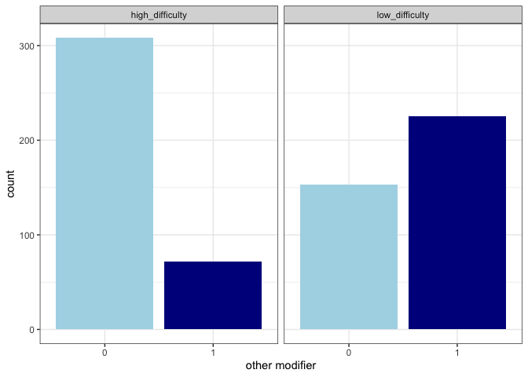
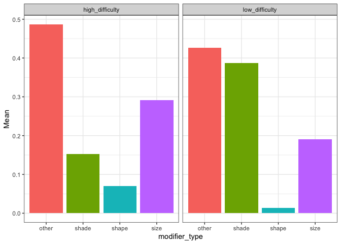

Production Experiment
================

**Number of participants tested:**

Posted for 1 extra person because realized one person got disconnected
while in the waiting room

    ## [1] 101

    ## 
    ## listener  speaker 
    ##       50       51

**Number of gameids in the server vs mturk data:**

TODO: fix this using unique.R

    ## [1] 53

    ## [1] 55

**Exclusions**

Remove games with non-native speakers:

    ##   gameID
    ## 1 7754-6

**Number of rounds for each
    game**

    ## `summarise()` ungrouping output (override with `.groups` argument)

    ## 
    ##  2  3  4 13 14 17 22 28 31 32 
    ##  1  1  1  1  1  1  1  1  1 43

## Critical trials

    ## 
    ## high_difficulty  low_difficulty 
    ##               8               8

**Was a color mentioned?**

    ## 
    ##   0   1 
    ##  72 686

**Was a material mentioned?**

    ## 
    ##   0   1 
    ## 546 212

**Was both a color and material mentioned?**

    ## 
    ##   0   1 
    ## 578 180

**Was an object name mentioned?**

    ## 
    ##   0   1 
    ## 275 483

**Was a bleached noun used?**

    ## 
    ##   0   1 
    ## 739  19

**Was an article used?**

    ## 
    ##   0   1 
    ## 227 531

**How often were articles
    omitted**

    ## [1] "percentage trials where articles were omitted:  36.2796833773087"

**How often were nouns
    omitted**

    ## [1] "percentage of trials where nouns were omitted:  29.6833773087071"

**Reading corrected dataset for typos and mention of other
    modifiers**

    ## [1] "percentage of trials where other modifiers were used:  39.1820580474934"

<!-- -->

**Types of modifiers
    used**

    ## `summarise()` regrouping output by 'modifier_type' (override with `.groups` argument)

<!-- -->

**In how many trials did the listener choose the right object?**

    ## 
    ##   0   1 
    ##  29 729

    ## [1] "percentage of trials where non-target was selected:  3.82585751978892"

    ##                  
    ##                     0   1
    ##   high_difficulty  11 369
    ##   low_difficulty   18 360

**Exclude trials where target wasn’t selected**

Number of rows:

    ## [1] 729

**Proportion of utterance by utterance type and trial
    type**

    ## `summarise()` regrouping output by 'RedundantProperty', 'trialType' (override with `.groups` argument)

<!-- -->

**Mixed effects logistic regression predicting redundant adjective use
from fixed effects of redundant property, with random by-subject and
by-item intercepts and slopes for redundant
    property**

    ## Warning in checkConv(attr(opt, "derivs"), opt$par, ctrl = control$checkConv, :
    ## Model failed to converge with max|grad| = 0.0553896 (tol = 0.002, component 1)

    ## Warning in checkConv(attr(opt, "derivs"), opt$par, ctrl = control$checkConv, : Model is nearly unidentifiable: very large eigenvalue
    ##  - Rescale variables?

    ## Generalized linear mixed model fit by maximum likelihood (Laplace
    ##   Approximation) [glmerMod]
    ##  Family: binomial  ( logit )
    ## Formula: redundant ~ trialType + (1 | gameid) + (1 | clickedobject)
    ##    Data: targets
    ## 
    ##      AIC      BIC   logLik deviance df.resid 
    ##    515.2    533.3   -253.6    507.2      688 
    ## 
    ## Scaled residuals: 
    ##     Min      1Q  Median      3Q     Max 
    ## -2.8722 -0.3427 -0.1206  0.0188  5.1311 
    ## 
    ## Random effects:
    ##  Groups        Name        Variance Std.Dev.
    ##  gameid        (Intercept) 2.547    1.596   
    ##  clickedobject (Intercept) 2.731    1.653   
    ## Number of obs: 692, groups:  gameid, 51; clickedobject, 9
    ## 
    ## Fixed effects:
    ##                          Estimate Std. Error z value Pr(>|z|)    
    ## (Intercept)             -2.798401   0.001362   -2055   <2e-16 ***
    ## trialTypelow_difficulty  1.775660   0.001319    1346   <2e-16 ***
    ## ---
    ## Signif. codes:  0 '***' 0.001 '**' 0.01 '*' 0.05 '.' 0.1 ' ' 1
    ## 
    ## Correlation of Fixed Effects:
    ##             (Intr)
    ## trlTyplw_df 0.000 
    ## convergence code: 0
    ## Model failed to converge with max|grad| = 0.0553896 (tol = 0.002, component 1)
    ## Model is nearly unidentifiable: very large eigenvalue
    ##  - Rescale variables?

**with other
    modifiers**

    ## `summarise()` regrouping output by 'RedundantProperty', 'trialType' (override with `.groups` argument)

<!-- -->

## Fillers

**16 filler trials**

4 filler\_color: competitor shares the color with the target

4 filler\_material: competitor shares the material with the target

4 filler\_both: competitor shares both color and material with the
target

4 filler\_none: competitor doesn’t share any feature with the target

    ## [1] 752

**Was a color mentioned?**

    ## 
    ##   0   1 
    ## 416 336

**Was a material mentioned?**

    ## 
    ##   0   1 
    ## 633 119

**Was both a color and material mentioned?**

    ## 
    ##   0   1 
    ## 707  45

**Was an object name mentioned?**

    ## 
    ##   0   1 
    ## 176 576

**In how many trials did the listener choose the right object?**

    ## 
    ##   0   1 
    ##  14 738

    ## [1] "percentage of trials where non-target was chosen:  1.86170212765957"

    ##                  
    ##                     0   1
    ##   high_difficulty  11 369
    ##   low_difficulty   18 360

**Exclude filler trials where target wasn’t selected**

Number of
    rows:

    ## [1] 738

    ## `summarise()` regrouping output by 'clickedObjCondition' (override with `.groups` argument)

<!-- --> **Mixed effects
logistic regression predicting redundant adjective use from fixed
effects of redundant property, with random by-subject and by-item
intercepts and slopes for redundant property** going from high
difficulty-material redundant(0) to low difficulty-color redundant(1) &
no redundancy(0) to redundancy(1) –\> should be
    positive

    ## Warning in checkConv(attr(opt, "derivs"), opt$par, ctrl = control$checkConv, :
    ## Model failed to converge with max|grad| = 0.0553896 (tol = 0.002, component 1)

    ## Warning in checkConv(attr(opt, "derivs"), opt$par, ctrl = control$checkConv, : Model is nearly unidentifiable: very large eigenvalue
    ##  - Rescale variables?

    ## Generalized linear mixed model fit by maximum likelihood (Laplace
    ##   Approximation) [glmerMod]
    ##  Family: binomial  ( logit )
    ## Formula: redundant ~ trialType + (1 | gameid) + (1 | clickedobject)
    ##    Data: targets
    ## 
    ##      AIC      BIC   logLik deviance df.resid 
    ##    515.2    533.3   -253.6    507.2      688 
    ## 
    ## Scaled residuals: 
    ##     Min      1Q  Median      3Q     Max 
    ## -2.8722 -0.3427 -0.1206  0.0188  5.1311 
    ## 
    ## Random effects:
    ##  Groups        Name        Variance Std.Dev.
    ##  gameid        (Intercept) 2.547    1.596   
    ##  clickedobject (Intercept) 2.731    1.653   
    ## Number of obs: 692, groups:  gameid, 51; clickedobject, 9
    ## 
    ## Fixed effects:
    ##                          Estimate Std. Error z value Pr(>|z|)    
    ## (Intercept)             -2.798401   0.001362   -2055   <2e-16 ***
    ## trialTypelow_difficulty  1.775660   0.001319    1346   <2e-16 ***
    ## ---
    ## Signif. codes:  0 '***' 0.001 '**' 0.01 '*' 0.05 '.' 0.1 ' ' 1
    ## 
    ## Correlation of Fixed Effects:
    ##             (Intr)
    ## trlTyplw_df 0.000 
    ## convergence code: 0
    ## Model failed to converge with max|grad| = 0.0553896 (tol = 0.002, component 1)
    ## Model is nearly unidentifiable: very large eigenvalue
    ##  - Rescale variables?
