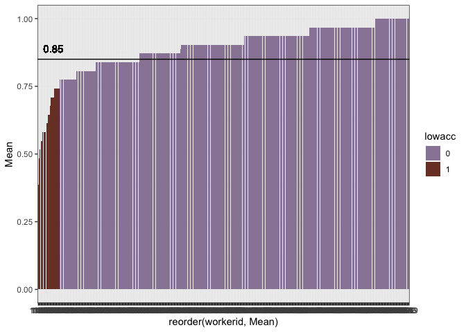
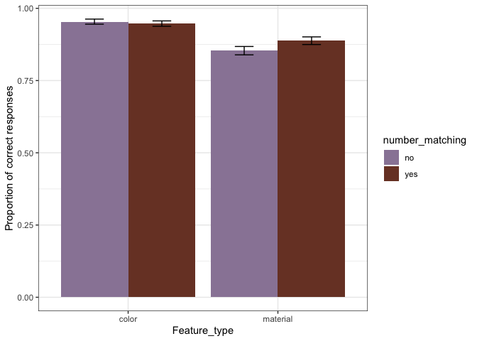
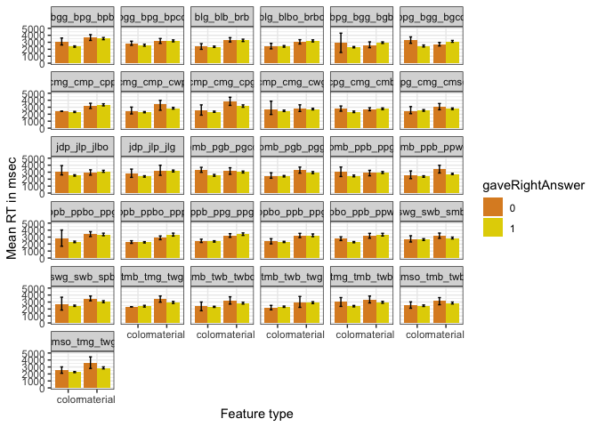

Perception in Context
================

**Number of participants tested:**

    ## [1] 408

    ## 
    ## list1 list2 list3 list4 list5 list6 list7 list8 
    ##    50    50    48    51    56    53    50    50

**Stimuli check:**

    ##      
    ##            color material
    ##   no     0  3185     3159
    ##   yes    0  3153     3151

**Proportion of correct responses by list**

**Exclusions**

Remove responses from non-native speakers: 0 participants TODO: fix this
(for now, all pt are native)

Participants with accuracy lower than 75% are excluded: 24
    participants

    ## `summarise()` ungrouping output (override with `.groups` argument)

<!-- -->

    ## # A tibble: 24 x 7
    ##    workerid  Mean CILow CIHigh  YMin  YMax lowacc
    ##       <int> <dbl> <dbl>  <dbl> <dbl> <dbl> <chr> 
    ##  1     1122 0.581 0.194  0.161 0.387 0.742 1     
    ##  2     1124 0.548 0.161  0.161 0.387 0.710 1     
    ##  3     1171 0.742 0.161  0.161 0.581 0.903 1     
    ##  4     1182 0.484 0.161  0.161 0.323 0.645 1     
    ##  5     1211 0.742 0.161  0.129 0.581 0.871 1     
    ##  6     1234 0.742 0.161  0.129 0.581 0.871 1     
    ##  7     1242 0.645 0.161  0.162 0.484 0.807 1     
    ##  8     1326 0.710 0.161  0.161 0.548 0.871 1     
    ##  9     1330 0.581 0.161  0.194 0.419 0.774 1     
    ## 10     1334 0.548 0.161  0.161 0.387 0.710 1     
    ## # … with 14 more rows

Responses with RT 2.5SD away from the mean are excluded: 217 responses

    ## [1] 271

**Response time
    distribution**

    ## `stat_bin()` using `bins = 30`. Pick better value with `binwidth`.

<!-- -->

### Error Rates

**Proportion of correct responses by feature type and number
    match**

    ## `summarise()` regrouping output by 'featureQuestion' (override with `.groups` argument)

<!-- --> **Proportion of
correct responses (by
    context)**

    ## `summarise()` regrouping output by 'contextID', 'featureQuestion' (override with `.groups` argument)

<!-- -->

### Response Times

**RTs by feature type, number match and response
    correctness**

    ## `summarise()` regrouping output by 'featureQuestion', 'gaveRightAnswer' (override with `.groups` argument)

<!-- --> **RTs by feature
type, response correctness and
    context**

    ## `summarise()` regrouping output by 'contextID', 'featureQuestion' (override with `.groups` argument)

<!-- -->

### Grouping

Proportion of correct answer(acceptance\&rejections) and RT of correct
answers

    ## `summarise()` regrouping output by 'contextID' (override with `.groups` argument)

    ## `summarise()` regrouping output by 'contextID', 'adjQuestion' (override with `.groups` argument)

    ## # A tibble: 124 x 6
    ## # Groups:   contextID [31]
    ##    contextID     adjQuestion MeanProp featureQuestion MeanRT targetsFeature
    ##    <fct>         <fct>          <dbl> <fct>            <dbl>          <dbl>
    ##  1 swg_swb_spb   green          0.986 color            1243               1
    ##  2 cmp_cmg_cwg   purple         0.988 color            1960               1
    ##  3 blg_blbo_brbo green          0.944 color            2077.              1
    ##  4 ppb_ppbo_ppp  blue           0.987 color            2136               1
    ##  5 cpg_cmg_cmso  green          0.962 color            2152               1
    ##  6 tmb_twb_twg   green          0.963 color            2158.              0
    ##  7 swg_swb_smb   green          0.980 color            2171               1
    ##  8 tmg_tmb_twb   green          0.987 color            2176               1
    ##  9 tmb_twb_twg   blue           0.944 color            2202.              1
    ## 10 pmb_pgb_pgg   blue           0.963 color            2238.              1
    ## # … with 114 more rows
