Perceptual Difficulty - Norming for Typicality
================

    ## Warning: Using alpha for a discrete variable is not advised.

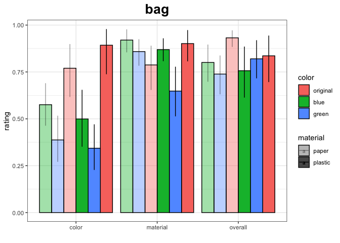<!-- -->

    ## Warning: Using alpha for a discrete variable is not advised.

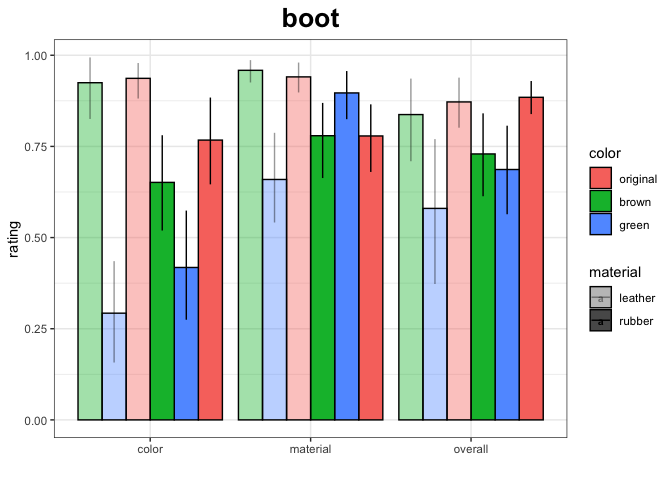<!-- -->

    ## Warning: Using alpha for a discrete variable is not advised.

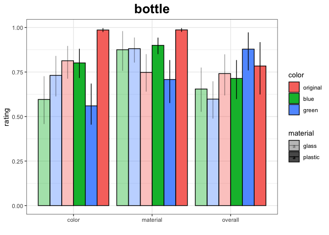<!-- -->

    ## Warning: Using alpha for a discrete variable is not advised.

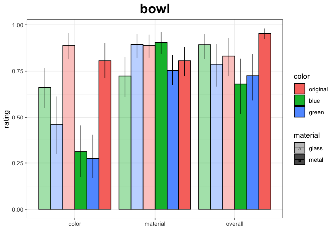<!-- -->

    ## Warning: Using alpha for a discrete variable is not advised.

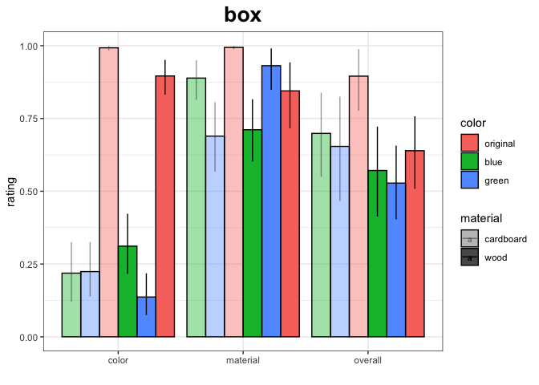<!-- -->

    ## Warning: Using alpha for a discrete variable is not advised.

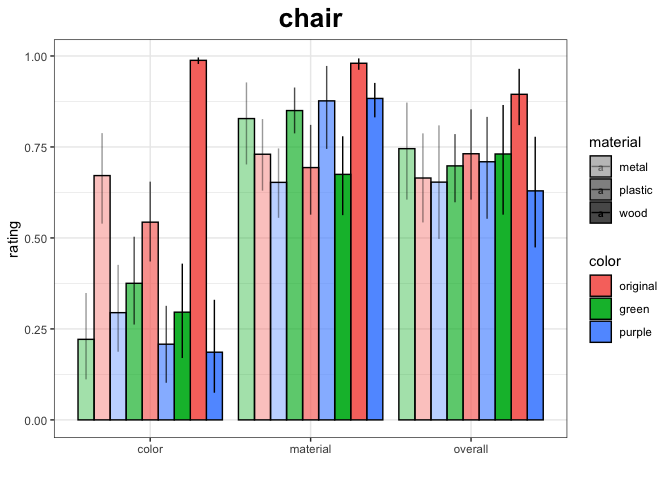<!-- -->

    ## Warning: Using alpha for a discrete variable is not advised.

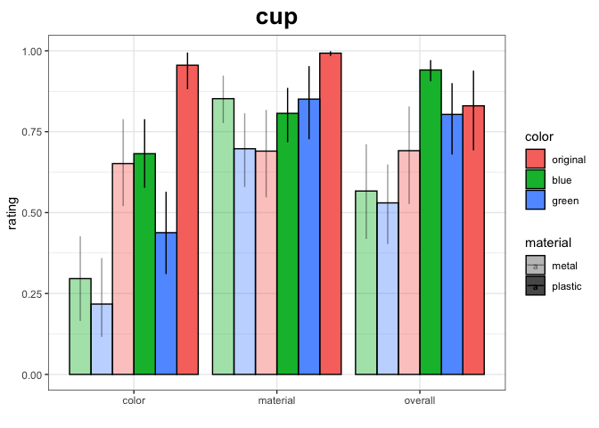<!-- -->

    ## Warning: Using alpha for a discrete variable is not advised.

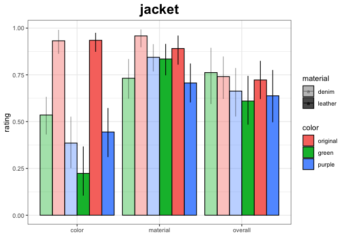<!-- -->

    ## Warning: Using alpha for a discrete variable is not advised.

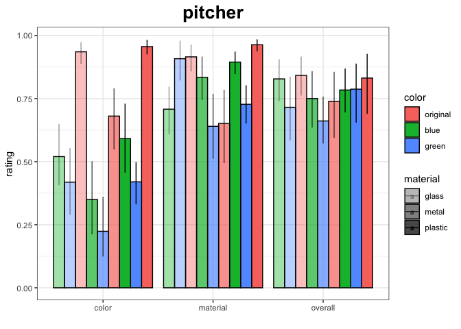<!-- -->

    ## Warning: Using alpha for a discrete variable is not advised.

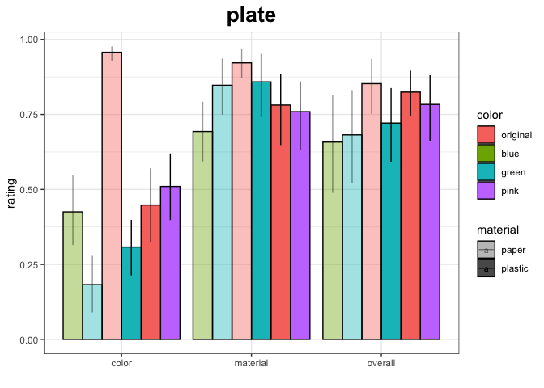<!-- -->

    ## Warning: Using alpha for a discrete variable is not advised.

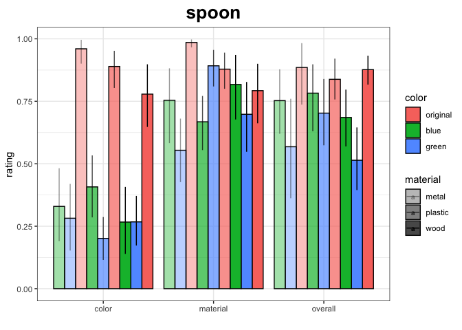<!-- -->

    ## Warning: Using alpha for a discrete variable is not advised.

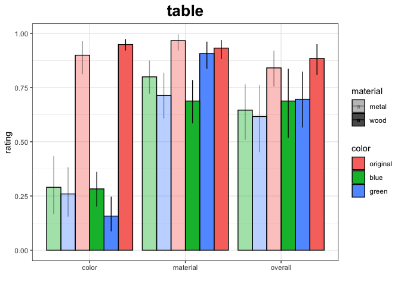<!-- -->
