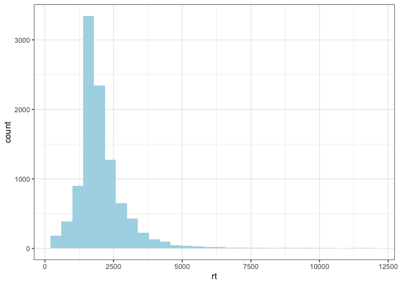
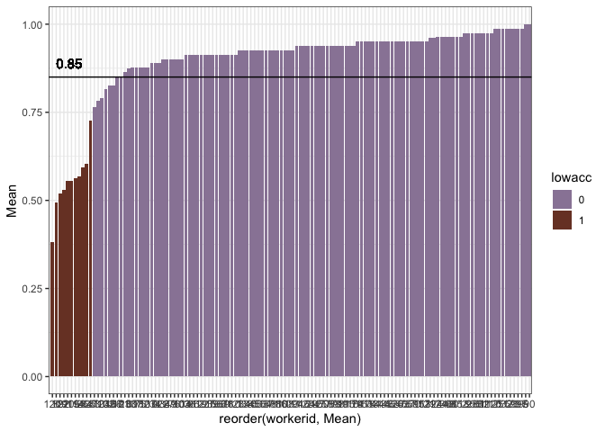
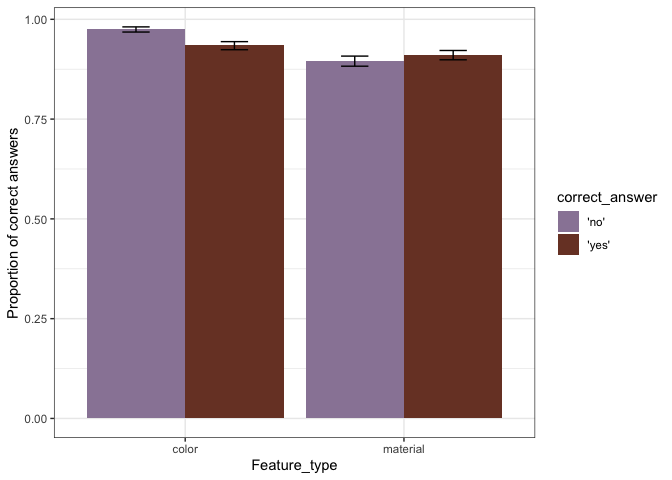
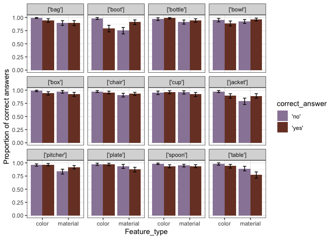
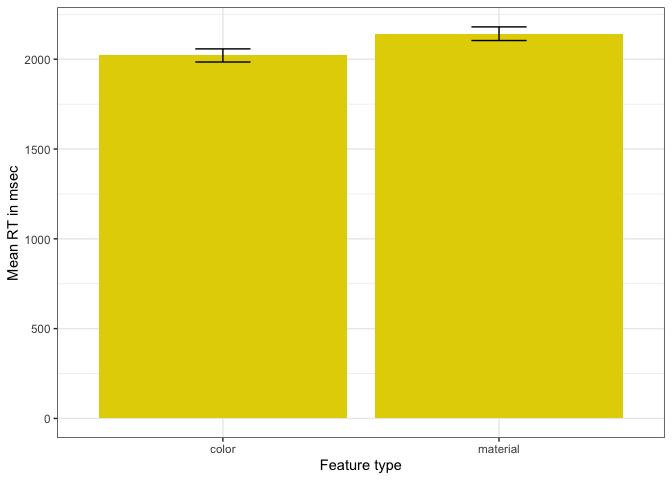
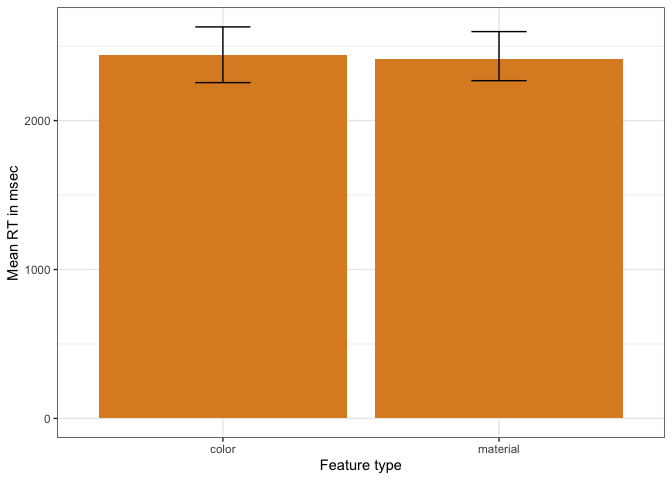
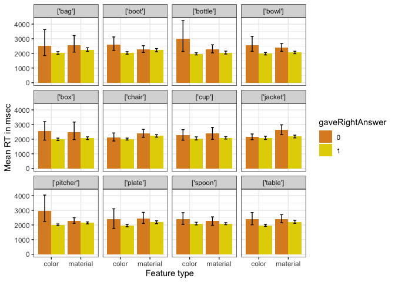
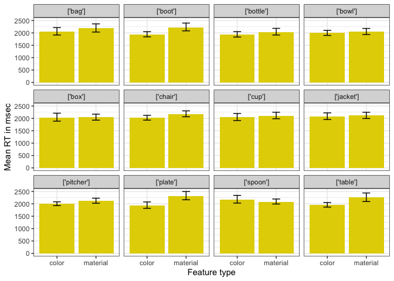
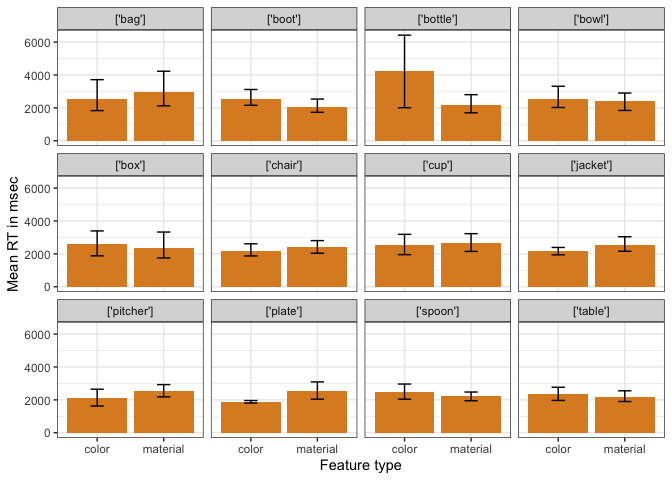

Perceptual Difficulty - Perceptibility
================

**Stimuli check**

    ##        
    ##            color material
    ##   'no'   0    81       81
    ##   'yes'  0    81       81

**Fastest and slowest response
    times**

    ##  [1] 408 408 415 415 416 417 417 423 423 424

    ##  [1]  25746  29143  36444  37743  40953  66284  71226  77544 133226 484279

**RT Exclusions and distribution** Response times that are 2SD away from
the mean are excluded (25
    responses)

    ##    workerid                  label     rt slow     Mean      SD   Ulimit    id
    ## 1         1   chair_plastic_purple  40953    1 2158.266 5260.45 12679.16   101
    ## 2         8       plate_paper_blue  29143    1 2158.266 5260.45 12679.16   671
    ## 3         8    chair_wood_original  37743    1 2158.266 5260.45 12679.16   693
    ## 4        14     chair_metal_purple  16517    1 2158.266 5260.45 12679.16  1153
    ## 5        22  jacket_leather_purple  71226    1 2158.266 5260.45 12679.16  1827
    ## 6        25         bag_paper_blue  66284    1 2158.266 5260.45 12679.16  2046
    ## 7        25  boot_leather_original 133226    1 2158.266 5260.45 12679.16  2059
    ## 8        25   chair_metal_original  22654    1 2158.266 5260.45 12679.16  2080
    ## 9        25       bowl_metal_green  77544    1 2158.266 5260.45 12679.16  2087
    ## 10       36 plate_plastic_original  13863    1 2158.266 5260.45 12679.16  2937
    ## 11       72   pitcher_plastic_blue  20260    1 2158.266 5260.45 12679.16  5868
    ## 12       72     pitcher_glass_blue  36444    1 2158.266 5260.45 12679.16  5891
    ## 13       72   chair_plastic_purple  18509    1 2158.266 5260.45 12679.16  5892
    ## 14       74 pitcher_glass_original 484279    1 2158.266 5260.45 12679.16  6054
    ## 15       79     bottle_glass_green  13542    1 2158.266 5260.45 12679.16  6417
    ## 16       79    box_cardboard_green  13458    1 2158.266 5260.45 12679.16  6418
    ## 17       79       cup_plastic_blue  20541    1 2158.266 5260.45 12679.16  6419
    ## 18       79  jacket_denim_original  13042    1 2158.266 5260.45 12679.16  6420
    ## 19       96    jacket_denim_purple  24776    1 2158.266 5260.45 12679.16  7802
    ## 20      100       table_metal_blue  25746    1 2158.266 5260.45 12679.16  8110
    ## 21      100   chair_plastic_purple  14417    1 2158.266 5260.45 12679.16  8111
    ## 22      114      table_metal_green  15818    1 2158.266 5260.45 12679.16  9243
    ## 23      124 pitcher_glass_original  14008    1 2158.266 5260.45 12679.16 10087
    ## 24      125        bag_paper_green  16797    1 2158.266 5260.45 12679.16 10126
    ## 25      125   chair_metal_original  20352    1 2158.266 5260.45 12679.16 10163

    ## `stat_bin()` using `bins = 30`. Pick better value with `binwidth`.

<!-- -->

**Accuracy exclusions** Participants with accuracy lower than 75% are
excluded (11 participants)
<!-- -->

    ## # A tibble: 11 x 7
    ##    workerid  Mean  CILow CIHigh  YMin  YMax lowacc
    ##       <int> <dbl>  <dbl>  <dbl> <dbl> <dbl> <chr> 
    ##  1        8 0.494 0.101  0.101  0.392 0.595 1     
    ##  2       25 0.727 0.104  0.104  0.623 0.831 1     
    ##  3       26 0.593 0.111  0.0988 0.481 0.691 1     
    ##  4       84 0.605 0.0988 0.0988 0.506 0.704 1     
    ##  5       91 0.556 0.111  0.0988 0.444 0.654 1     
    ##  6       92 0.531 0.111  0.111  0.420 0.642 1     
    ##  7       94 0.568 0.111  0.111  0.457 0.679 1     
    ##  8      105 0.556 0.111  0.111  0.444 0.667 1     
    ##  9      114 0.562 0.112  0.100  0.45  0.662 1     
    ## 10      120 0.383 0.111  0.111  0.272 0.494 1     
    ## 11      122 0.519 0.111  0.111  0.407 0.630 1

**Proportion of correct responses**

<!-- -->

**By item - Proportion of correct and incorrect responses **

<!-- -->

**RTs to color and material features (everything collapsed)**

<!-- -->

**RTs to color and material features (only expected YES cases and
CORRECT responses)**

<!-- -->

**RTs to color and material features (only expected YES cases and
INCORRECT responses)**

<!-- -->

**By item**

<!-- -->

**By item (only expected YES cases and CORRECT responses)**

<!-- -->

**By item (only expected YES cases and INCORRECT responses)**

<!-- -->

**By image** (plot in graphs/)

**By image (only expected YES cases and CORRECT responses)** (plot in
graphs/)

**By image (only expected YES cases and INCORRECT responses)** (plot in
graphs/)
