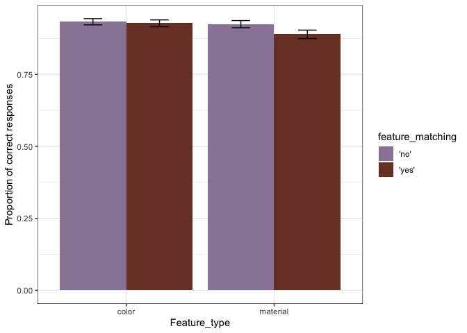
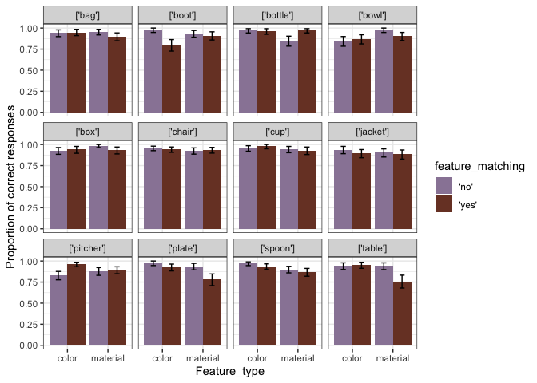
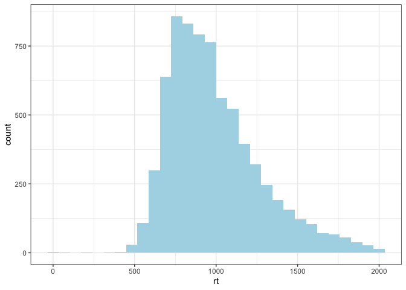
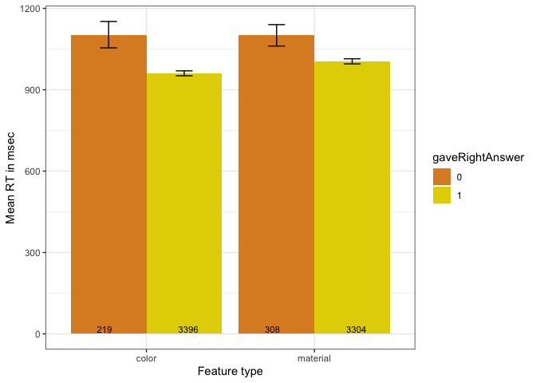
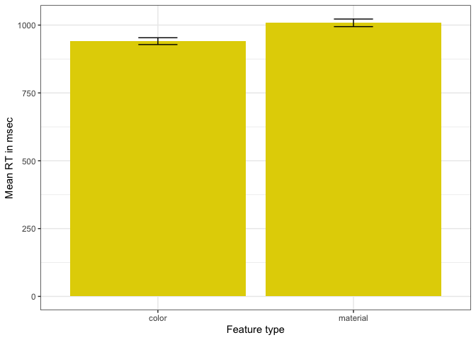
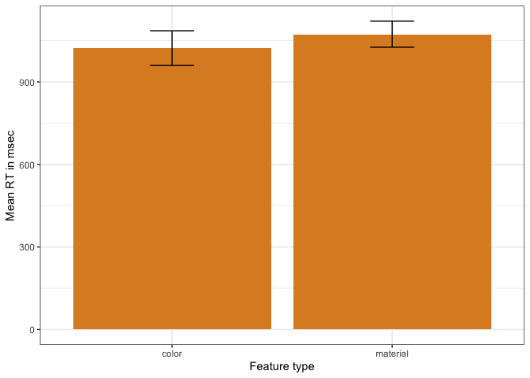
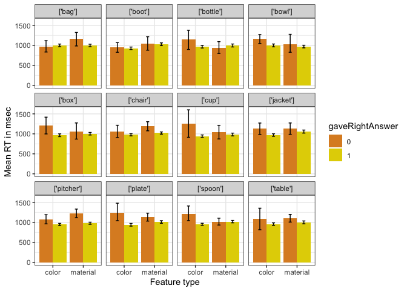
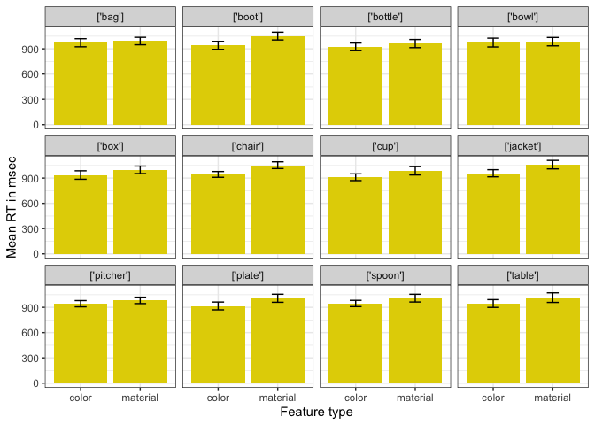
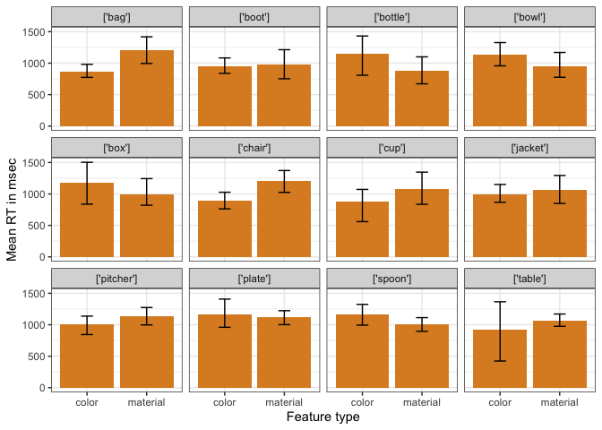

Perceptual Difficulty - Timed Perceptibility
================

**Stimuli check**

    ##        
    ##            color material
    ##   'no'   0    81       81
    ##   'yes'  0    81       81

**Accuracy exclusions** Participants with accuracy lower than 75% are
excluded (11 participants)
<!-- -->

    ## # A tibble: 29 x 7
    ##    workerid  Mean  CILow CIHigh  YMin  YMax lowacc
    ##       <int> <dbl>  <dbl>  <dbl> <dbl> <dbl> <chr> 
    ##  1        2 0.630 0.0988 0.0988 0.531 0.728 1     
    ##  2        4 0.543 0.0988 0.111  0.444 0.654 1     
    ##  3        5 0.617 0.111  0.0988 0.506 0.716 1     
    ##  4       11 0.519 0.0988 0.0988 0.420 0.617 1     
    ##  5       12 0.444 0.111  0.111  0.333 0.556 1     
    ##  6       13 0.667 0.111  0.0988 0.556 0.765 1     
    ##  7       14 0.519 0.0988 0.0988 0.420 0.617 1     
    ##  8       31 0.494 0.111  0.111  0.383 0.605 1     
    ##  9       38 0.568 0.0991 0.111  0.469 0.679 1     
    ## 10       39 0.395 0.111  0.111  0.284 0.506 1     
    ## # … with 19 more rows

**Proportion of correct responses**

<!-- -->

**By item - Proportion of correct responses**

<!-- -->

**By unique item - Proportion of correct responses to matching
features** (plot in graphs/)

**RT Distribution** Late responses
    removed

    ## `stat_bin()` using `bins = 30`. Pick better value with `binwidth`.

<!-- -->

**RTs to color and material features (everything collapsed)**

<!-- -->

**RTs to color and material features (only correct responses to matching
features)**

<!-- -->

**RTs to color and material features (only incorrect responses to
matching features)**

<!-- -->

**By item**

<!-- -->

**By item (only correct responses to matching features)**

<!-- -->

**By item (only incorrect responses to matching features)**

<!-- -->

**By image** (plot in graphs/)

**By image (only correct responses to matching features)** (plot in
graphs/)

**By image (only incorrect responses to matching features)** (plot in
graphs/)
