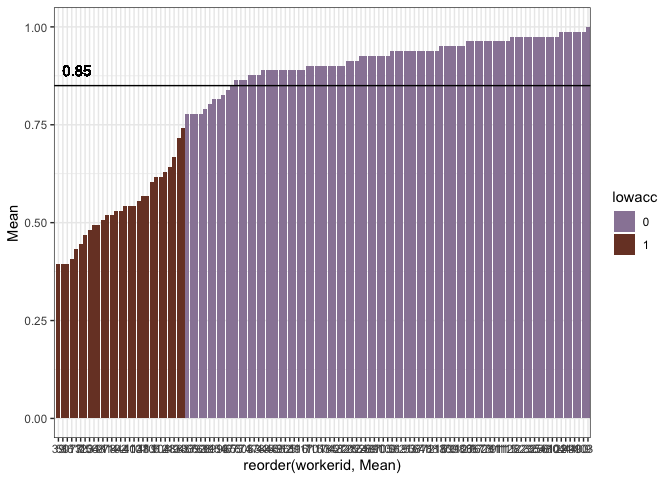

Perceptual Difficulty - Timed Perceptibility2 (difficulty analysis)
================

**Stimuli check**

    ##        
    ##            color material
    ##   'no'   0    81       81
    ##   'yes'  0    81       81

**Accuracy exclusions** Participants with accuracy lower than 75% are
excluded (29 participants)
<!-- -->

    ## # A tibble: 29 x 7
    ##    workerid  Mean  CILow CIHigh  YMin  YMax lowacc
    ##       <int> <dbl>  <dbl>  <dbl> <dbl> <dbl> <chr> 
    ##  1        2 0.630 0.0867 0.0988 0.543 0.728 1     
    ##  2        4 0.543 0.123  0.111  0.420 0.654 1     
    ##  3        5 0.617 0.0988 0.111  0.519 0.728 1     
    ##  4       11 0.519 0.111  0.111  0.407 0.630 1     
    ##  5       12 0.444 0.111  0.111  0.333 0.556 1     
    ##  6       13 0.667 0.123  0.111  0.543 0.778 1     
    ##  7       14 0.519 0.111  0.111  0.407 0.630 1     
    ##  8       31 0.494 0.111  0.0991 0.383 0.593 1     
    ##  9       38 0.568 0.111  0.0988 0.457 0.667 1     
    ## 10       39 0.395 0.0988 0.111  0.296 0.506 1     
    ## # … with 19 more rows

# By response times

**Regardless of response correctness and feature matching**

    ## # A tibble: 15 x 7
    ##    label                   feature      Mean CILow CIHigh count group
    ##    <fct>                   <fct>       <dbl> <dbl>  <dbl> <int> <chr>
    ##  1 bowl_metal_green        ['silver']  1239. 139.    137.    22 rt   
    ##  2 chair_metal_purple      ['metal']   1222. 130.    138.    24 rt   
    ##  3 pitcher_glass_blue      ['plastic'] 1190. 148.    155.    23 rt   
    ##  4 jacket_leather_green    ['denim']   1184. 106.    116.    23 rt   
    ##  5 chair_metal_purple      ['silver']  1183. 155.    166.    22 rt   
    ##  6 jacket_leather_original ['rubber']  1160. 110.    117.    24 rt   
    ##  7 pitcher_plastic_blue    ['rubber']  1158. 136.    150.    23 rt   
    ##  8 jacket_denim_purple     ['denim']   1157. 134.    136.    23 rt   
    ##  9 chair_metal_purple      ['plastic'] 1149. 114.    118.    24 rt   
    ## 10 boot_leather_brown      ['rubber']  1149.  94.8   106.    23 rt   
    ## 11 jacket_leather_green    ['leather'] 1144. 154.    164.    19 rt   
    ## 12 boot_leather_green      ['leather'] 1139. 117.    116.    23 rt   
    ## 13 jacket_leather_purple   ['leather'] 1135. 156.    162.    23 rt   
    ## 14 pitcher_metal_blue      ['metal']   1134. 131.    148.    24 rt   
    ## 15 jacket_denim_purple     ['blue']    1132. 146.    145.    23 rt

    ## # A tibble: 15 x 7
    ##    label                  feature        Mean CILow CIHigh count group
    ##    <fct>                  <fct>         <dbl> <dbl>  <dbl> <int> <chr>
    ##  1 spoon_plastic_original ['red']        878.  89.5   97.1    24 rt   
    ##  2 cup_metal_blue         ['blue']       877.  81.8   83.3    22 rt   
    ##  3 pitcher_glass_green    ['wood']       877.  77.2   85.9    24 rt   
    ##  4 chair_plastic_green    ['green']      874.  82.5   90.8    24 rt   
    ##  5 table_metal_blue       ['blue']       873.  91.5  104.     23 rt   
    ##  6 plate_plastic_original ['blue']       873. 102.   111.     19 rt   
    ##  7 pitcher_metal_green    ['green']      872.  88.4   96.0    24 rt   
    ##  8 box_cardboard_original ['cardboard']  866.  95.3  107.     19 rt   
    ##  9 chair_metal_original   ['paper']      863. 113.   117.     19 rt   
    ## 10 boot_leather_green     ['green']      863.  82.7   79.0    24 rt   
    ## 11 cup_plastic_blue       ['blue']       861.  85.7   99.0    20 rt   
    ## 12 cup_plastic_green      ['green']      860.  95.2   91.3    22 rt   
    ## 13 plate_plastic_green    ['green']      853   89.5  115.     24 rt   
    ## 14 spoon_metal_original   ['pink']       829.  61.3   70.5    24 rt   
    ## 15 spoon_plastic_blue     ['blue']       821.  61.3   66.4    24 rt

**Only correct responses, regardless of feature matching**

    ## # A tibble: 15 x 7
    ##    label                    feature      Mean CILow CIHigh count group     
    ##    <fct>                    <fct>       <dbl> <dbl>  <dbl> <int> <chr>     
    ##  1 bowl_metal_green         ['silver']  1246.  152.  165.      7 correct_rt
    ##  2 bottle_plastic_blue      ['glass']   1232   172.  161.     15 correct_rt
    ##  3 jacket_leather_green     ['denim']   1205.  108.  114.     15 correct_rt
    ##  4 spoon_wood_green         ['plastic'] 1200.  175.  187.      9 correct_rt
    ##  5 jacket_denim_purple      ['denim']   1196.  136.  146.     20 correct_rt
    ##  6 chair_metal_purple       ['metal']   1185.  131.  147.     22 correct_rt
    ##  7 jacket_leather_original  ['rubber']  1176.  106.  114.     22 correct_rt
    ##  8 jacket_leather_purple    ['leather'] 1173.  146.  161.     18 correct_rt
    ##  9 table_metal_blue         ['metal']   1171.  166.  176.     10 correct_rt
    ## 10 chair_metal_purple       ['plastic'] 1169.  157.  160.     16 correct_rt
    ## 11 bottle_glass_original    ['plastic'] 1149.  149.  168.     19 correct_rt
    ## 12 boot_leather_green       ['leather'] 1144.  106.  113.     20 correct_rt
    ## 13 bowl_glass_green         ['blue']    1143.  125.  119.     22 correct_rt
    ## 14 pitcher_plastic_original ['plastic'] 1141.  180.  197.     19 correct_rt
    ## 15 boot_leather_brown       ['rubber']  1134.  102.   95.0    20 correct_rt

    ## # A tibble: 15 x 7
    ##    label                  feature        Mean CILow CIHigh count group     
    ##    <fct>                  <fct>         <dbl> <dbl>  <dbl> <int> <chr>     
    ##  1 cup_plastic_original   ['clear']      878.  79.8   81.9    23 correct_rt
    ##  2 cup_metal_blue         ['blue']       877.  79.1   85.7    22 correct_rt
    ##  3 pitcher_glass_green    ['wood']       877.  76.8   83.9    24 correct_rt
    ##  4 chair_plastic_green    ['green']      874.  82.3   94.7    24 correct_rt
    ##  5 table_metal_blue       ['blue']       873.  97.2  105.     23 correct_rt
    ##  6 pitcher_metal_green    ['green']      872.  93.4   89.7    24 correct_rt
    ##  7 box_cardboard_original ['cardboard']  866.  91.7   99.9    19 correct_rt
    ##  8 chair_metal_original   ['paper']      863. 113.   112.     19 correct_rt
    ##  9 boot_leather_green     ['green']      863.  84.8   82.6    24 correct_rt
    ## 10 cup_plastic_blue       ['blue']       861.  96.3   92.2    20 correct_rt
    ## 11 cup_plastic_green      ['green']      860.  95.4   95.9    22 correct_rt
    ## 12 plate_plastic_green    ['green']      848.  96.2  111.     23 correct_rt
    ## 13 plate_paper_original   ['white']      839.  68.5   77.6    21 correct_rt
    ## 14 spoon_metal_original   ['pink']       829.  65     63.8    24 correct_rt
    ## 15 spoon_plastic_blue     ['blue']       821.  60.7   62.7    24 correct_rt

**Only correct responses, only matching features**

    ## # A tibble: 15 x 7
    ##    label                  feature      Mean CILow CIHigh count group            
    ##    <fct>                  <fct>       <dbl> <dbl>  <dbl> <int> <chr>            
    ##  1 jacket_denim_purple    ['denim']   1196. 144.   137.     20 correct_matching…
    ##  2 chair_metal_purple     ['metal']   1185. 138.   135.     22 correct_matching…
    ##  3 jacket_leather_purple  ['leather'] 1173. 137.   167.     18 correct_matching…
    ##  4 table_metal_blue       ['metal']   1171. 159.   168.     10 correct_matching…
    ##  5 boot_leather_green     ['leather'] 1144. 103.   110.     20 correct_matching…
    ##  6 pitcher_plastic_origi… ['plastic'] 1141. 166.   193.     19 correct_matching…
    ##  7 jacket_leather_green   ['leather'] 1127. 149.   149.     17 correct_matching…
    ##  8 spoon_wood_blue        ['wood']    1126. 136.   146.     18 correct_matching…
    ##  9 pitcher_metal_green    ['metal']   1122. 155.   169.     15 correct_matching…
    ## 10 chair_metal_green      ['metal']   1118.  95.3   89.3    21 correct_matching…
    ## 11 table_metal_green      ['metal']   1115. 157.   173.     16 correct_matching…
    ## 12 boot_rubber_brown      ['rubber']  1111. 124.   145.     23 correct_matching…
    ## 13 spoon_metal_green      ['metal']   1091. 124.   143.     19 correct_matching…
    ## 14 chair_plastic_original ['plastic'] 1087. 127.   155.     19 correct_matching…
    ## 15 chair_plastic_purple   ['plastic'] 1077.  80.0   75.6    20 correct_matching…

    ## # A tibble: 15 x 7
    ##    label                 feature       Mean CILow CIHigh count group            
    ##    <fct>                 <fct>        <dbl> <dbl>  <dbl> <int> <chr>            
    ##  1 bottle_glass_green    ['glass']     884.  89.3   84.2    24 correct_matching…
    ##  2 plate_plastic_origin… ['blue']      880. 109.   122.     18 correct_matching…
    ##  3 bag_plastic_blue      ['plastic']   879. 102.   113.     16 correct_matching…
    ##  4 cup_plastic_original  ['clear']     878.  73.9   85.0    23 correct_matching…
    ##  5 cup_metal_blue        ['blue']      877.  81.5   81.6    22 correct_matching…
    ##  6 chair_plastic_green   ['green']     874.  80.3   92.9    24 correct_matching…
    ##  7 table_metal_blue      ['blue']      873. 105.   102.     23 correct_matching…
    ##  8 pitcher_metal_green   ['green']     872.  86.0   92.0    24 correct_matching…
    ##  9 box_cardboard_origin… ['cardboard…  866.  90.2  108.     19 correct_matching…
    ## 10 boot_leather_green    ['green']     863.  83.9   82.7    24 correct_matching…
    ## 11 cup_plastic_blue      ['blue']      861.  82.8   84.1    20 correct_matching…
    ## 12 cup_plastic_green     ['green']     860.  86.9   99.0    22 correct_matching…
    ## 13 plate_plastic_green   ['green']     848.  97.9  113.     23 correct_matching…
    ## 14 plate_paper_original  ['white']     839.  69.7   76.5    21 correct_matching…
    ## 15 spoon_plastic_blue    ['blue']      821.  61.2   67.3    24 correct_matching…

**Only correct responses, only not matching features**

    ## # A tibble: 15 x 7
    ##    label                feature       Mean CILow CIHigh count group             
    ##    <fct>                <fct>        <dbl> <dbl>  <dbl> <int> <chr>             
    ##  1 bowl_metal_green     ['silver']   1246. 154.    158.     7 correct_notmatchi…
    ##  2 bottle_plastic_blue  ['glass']    1232  172.    183.    15 correct_notmatchi…
    ##  3 jacket_leather_green ['denim']    1205. 108.    107.    15 correct_notmatchi…
    ##  4 spoon_wood_green     ['plastic']  1200. 190.    188.     9 correct_notmatchi…
    ##  5 jacket_leather_orig… ['rubber']   1176. 114.    116.    22 correct_notmatchi…
    ##  6 chair_metal_purple   ['plastic']  1169. 164.    172.    16 correct_notmatchi…
    ##  7 bottle_glass_origin… ['plastic']  1149. 161.    160.    19 correct_notmatchi…
    ##  8 bowl_glass_green     ['blue']     1143. 123.    127.    22 correct_notmatchi…
    ##  9 boot_leather_brown   ['rubber']   1134. 107.    100.    20 correct_notmatchi…
    ## 10 spoon_wood_original  ['cardboard… 1107  103.    123.    22 correct_notmatchi…
    ## 11 chair_plastic_origi… ['wood']     1095. 106.    107.    18 correct_notmatchi…
    ## 12 plate_paper_green    ['glass']    1094. 120.    130.    20 correct_notmatchi…
    ## 13 spoon_wood_original  ['clear']    1093.  97.8   110.    22 correct_notmatchi…
    ## 14 chair_metal_purple   ['silver']   1091  145.    154.    19 correct_notmatchi…
    ## 15 bag_plastic_blue     ['purple']   1091. 130.    132.    23 correct_notmatchi…

    ## # A tibble: 15 x 7
    ##    label                feature      Mean CILow CIHigh count group              
    ##    <fct>                <fct>       <dbl> <dbl>  <dbl> <int> <chr>              
    ##  1 box_cardboard_green  ['denim']    902.  64.5   71.4    23 correct_notmatchin…
    ##  2 boot_rubber_brown    ['silver']   900.  92.1   87.2    22 correct_notmatchin…
    ##  3 bowl_metal_blue      ['wood']     900. 106.   114.     24 correct_notmatchin…
    ##  4 bottle_glass_origin… ['brown']    897.  74.9   77.2    23 correct_notmatchin…
    ##  5 bowl_metal_original  ['wood']     895.  94.8   96.7    19 correct_notmatchin…
    ##  6 jacket_leather_purp… ['red']      894.  78.4   91.9    22 correct_notmatchin…
    ##  7 table_metal_green    ['paper']    891.  78.6   85.8    18 correct_notmatchin…
    ##  8 boot_rubber_original ['red']      891.  93.1   96.0    22 correct_notmatchin…
    ##  9 bottle_plastic_green ['cardboar…  883.  80.1   87.2    20 correct_notmatchin…
    ## 10 boot_leather_green   ['pink']     880.  91.6  117.     19 correct_notmatchin…
    ## 11 bag_paper_blue       ['glass']    879.  86.8   92.8    19 correct_notmatchin…
    ## 12 spoon_plastic_origi… ['red']      878.  87.6   93.3    24 correct_notmatchin…
    ## 13 pitcher_glass_green  ['wood']     877.  76.2   87.5    24 correct_notmatchin…
    ## 14 chair_metal_original ['paper']    863. 112.   116.     19 correct_notmatchin…
    ## 15 spoon_metal_original ['pink']     829.  63.8   64.5    24 correct_notmatchin…

# By error rates

**Regardless of feature matching**

    ## # A tibble: 15 x 7
    ##    label                feature      Mean CILow CIHigh count group
    ##    <fct>                <fct>       <dbl> <dbl>  <dbl> <int> <chr>
    ##  1 boot_rubber_original ['green']   0     0      0        24 er   
    ##  2 pitcher_glass_blue   ['clear']   0     0      0        23 er   
    ##  3 bowl_metal_green     ['silver']  0.318 0.182  0.227    22 er   
    ##  4 spoon_wood_green     ['plastic'] 0.474 0.211  0.211    19 er   
    ##  5 table_metal_blue     ['metal']   0.526 0.211  0.211    19 er   
    ##  6 pitcher_glass_blue   ['plastic'] 0.565 0.217  0.174    23 er   
    ##  7 bottle_plastic_blue  ['glass']   0.625 0.168  0.208    24 er   
    ##  8 pitcher_metal_blue   ['metal']   0.625 0.208  0.167    24 er   
    ##  9 jacket_leather_green ['denim']   0.652 0.217  0.174    23 er   
    ## 10 chair_metal_purple   ['plastic'] 0.667 0.208  0.167    24 er   
    ## 11 table_metal_green    ['metal']   0.667 0.208  0.167    24 er   
    ## 12 pitcher_metal_green  ['metal']   0.682 0.182  0.182    22 er   
    ## 13 plate_paper_green    ['paper']   0.7   0.200  0.2      20 er   
    ## 14 spoon_metal_blue     ['metal']   0.7   0.200  0.2      20 er   
    ## 15 bottle_glass_blue    ['plastic'] 0.714 0.190  0.190    21 er

    ## # A tibble: 15 x 7
    ##    label                  feature      Mean CILow CIHigh count group
    ##    <fct>                  <fct>       <dbl> <dbl>  <dbl> <int> <chr>
    ##  1 spoon_plastic_blue     ['plastic']     1     0      0    23 er   
    ##  2 spoon_plastic_green    ['pink']        1     0      0    22 er   
    ##  3 spoon_plastic_original ['denim']       1     0      0    22 er   
    ##  4 spoon_plastic_original ['plastic']     1     0      0    19 er   
    ##  5 spoon_plastic_original ['red']         1     0      0    24 er   
    ##  6 spoon_wood_original    ['brown']       1     0      0    20 er   
    ##  7 table_metal_blue       ['blue']        1     0      0    23 er   
    ##  8 table_metal_blue       ['green']       1     0      0    24 er   
    ##  9 table_metal_green      ['blue']        1     0      0    24 er   
    ## 10 table_metal_green      ['green']       1     0      0    23 er   
    ## 11 table_metal_green      ['paper']       1     0      0    18 er   
    ## 12 table_wood_blue        ['leather']     1     0      0    23 er   
    ## 13 table_wood_original    ['brown']       1     0      0    24 er   
    ## 14 table_wood_original    ['plastic']     1     0      0    23 er   
    ## 15 table_wood_original    ['wood']        1     0      0    20 er

**Only matching features**

    ## # A tibble: 15 x 7
    ##    label                  feature      Mean CILow CIHigh count group      
    ##    <fct>                  <fct>       <dbl> <dbl>  <dbl> <int> <chr>      
    ##  1 boot_rubber_original   ['green']   0     0      0        24 matching_er
    ##  2 table_metal_blue       ['metal']   0.526 0.211  0.211    19 matching_er
    ##  3 pitcher_metal_blue     ['metal']   0.625 0.208  0.167    24 matching_er
    ##  4 table_metal_green      ['metal']   0.667 0.208  0.167    24 matching_er
    ##  5 pitcher_metal_green    ['metal']   0.682 0.182  0.182    22 matching_er
    ##  6 plate_paper_green      ['paper']   0.7   0.200  0.2      20 matching_er
    ##  7 spoon_metal_blue       ['metal']   0.7   0.200  0.2      20 matching_er
    ##  8 spoon_wood_blue        ['blue']    0.739 0.175  0.174    23 matching_er
    ##  9 bowl_metal_green       ['green']   0.75  0.167  0.167    24 matching_er
    ## 10 plate_plastic_original ['plastic'] 0.75  0.208  0.167    24 matching_er
    ## 11 bag_paper_green        ['paper']   0.783 0.174  0.130    23 matching_er
    ## 12 jacket_leather_purple  ['leather'] 0.783 0.174  0.132    23 matching_er
    ## 13 plate_paper_blue       ['paper']   0.783 0.174  0.130    23 matching_er
    ## 14 spoon_wood_blue        ['wood']    0.783 0.174  0.130    23 matching_er
    ## 15 table_metal_original   ['metal']   0.783 0.174  0.132    23 matching_er

    ## # A tibble: 15 x 7
    ##    label                    feature      Mean CILow CIHigh count group      
    ##    <fct>                    <fct>       <dbl> <dbl>  <dbl> <int> <chr>      
    ##  1 pitcher_metal_blue       ['blue']        1     0      0    21 matching_er
    ##  2 pitcher_metal_green      ['green']       1     0      0    24 matching_er
    ##  3 pitcher_plastic_blue     ['plastic']     1     0      0    24 matching_er
    ##  4 pitcher_plastic_green    ['green']       1     0      0    23 matching_er
    ##  5 pitcher_plastic_original ['white']       1     0      0    23 matching_er
    ##  6 spoon_metal_blue         ['blue']        1     0      0    23 matching_er
    ##  7 spoon_metal_original     ['silver']      1     0      0    22 matching_er
    ##  8 spoon_plastic_blue       ['blue']        1     0      0    24 matching_er
    ##  9 spoon_plastic_blue       ['plastic']     1     0      0    23 matching_er
    ## 10 spoon_plastic_original   ['plastic']     1     0      0    19 matching_er
    ## 11 spoon_wood_original      ['brown']       1     0      0    20 matching_er
    ## 12 table_metal_blue         ['blue']        1     0      0    23 matching_er
    ## 13 table_metal_green        ['green']       1     0      0    23 matching_er
    ## 14 table_wood_original      ['brown']       1     0      0    24 matching_er
    ## 15 table_wood_original      ['wood']        1     0      0    20 matching_er

**Only not matching features**

    ## # A tibble: 15 x 7
    ##    label                    feature      Mean CILow CIHigh count group         
    ##    <fct>                    <fct>       <dbl> <dbl>  <dbl> <int> <chr>         
    ##  1 pitcher_glass_blue       ['clear']   0     0      0        23 notmatching_er
    ##  2 bowl_metal_green         ['silver']  0.318 0.182  0.182    22 notmatching_er
    ##  3 spoon_wood_green         ['plastic'] 0.474 0.211  0.211    19 notmatching_er
    ##  4 pitcher_glass_blue       ['plastic'] 0.565 0.217  0.217    23 notmatching_er
    ##  5 bottle_plastic_blue      ['glass']   0.625 0.208  0.167    24 notmatching_er
    ##  6 jacket_leather_green     ['denim']   0.652 0.217  0.174    23 notmatching_er
    ##  7 chair_metal_purple       ['plastic'] 0.667 0.208  0.167    24 notmatching_er
    ##  8 bottle_glass_blue        ['plastic'] 0.714 0.190  0.190    21 notmatching_er
    ##  9 table_metal_original     ['black']   0.75  0.200  0.15     20 notmatching_er
    ## 10 jacket_denim_purple      ['blue']    0.783 0.174  0.174    23 notmatching_er
    ## 11 pitcher_plastic_blue     ['rubber']  0.826 0.130  0.130    23 notmatching_er
    ## 12 pitcher_plastic_original ['rubber']  0.826 0.174  0.130    23 notmatching_er
    ## 13 bag_plastic_green        ['rubber']  0.85  0.15   0.15     20 notmatching_er
    ## 14 chair_metal_green        ['clear']   0.85  0.15   0.15     20 notmatching_er
    ## 15 bottle_glass_original    ['plastic'] 0.864 0.182  0.136    22 notmatching_er

    ## # A tibble: 15 x 7
    ##    label                  feature      Mean CILow CIHigh count group         
    ##    <fct>                  <fct>       <dbl> <dbl>  <dbl> <int> <chr>         
    ##  1 plate_plastic_pink     ['silver']      1     0      0    20 notmatching_er
    ##  2 spoon_metal_blue       ['paper']       1     0      0    23 notmatching_er
    ##  3 spoon_metal_blue       ['pink']        1     0      0    24 notmatching_er
    ##  4 spoon_metal_green      ['black']       1     0      0    20 notmatching_er
    ##  5 spoon_metal_green      ['paper']       1     0      0    24 notmatching_er
    ##  6 spoon_metal_original   ['pink']        1     0      0    24 notmatching_er
    ##  7 spoon_metal_original   ['wood']        1     0      0    19 notmatching_er
    ##  8 spoon_plastic_green    ['pink']        1     0      0    22 notmatching_er
    ##  9 spoon_plastic_original ['denim']       1     0      0    22 notmatching_er
    ## 10 spoon_plastic_original ['red']         1     0      0    24 notmatching_er
    ## 11 table_metal_blue       ['green']       1     0      0    24 notmatching_er
    ## 12 table_metal_green      ['blue']        1     0      0    24 notmatching_er
    ## 13 table_metal_green      ['paper']       1     0      0    18 notmatching_er
    ## 14 table_wood_blue        ['leather']     1     0      0    23 notmatching_er
    ## 15 table_wood_original    ['plastic']     1     0      0    23 notmatching_er

# Is there overlap?

    ## # A tibble: 49 x 3
    ## # Groups:   label [36]
    ##    label                 feature     count
    ##    <fct>                 <fct>       <int>
    ##  1 bag_paper_green       ['paper']       1
    ##  2 bag_plastic_blue      ['purple']      1
    ##  3 bag_plastic_green     ['rubber']      1
    ##  4 boot_leather_brown    ['rubber']      3
    ##  5 boot_leather_green    ['leather']     3
    ##  6 boot_rubber_brown     ['rubber']      1
    ##  7 boot_rubber_original  ['green']       2
    ##  8 bottle_glass_blue     ['plastic']     2
    ##  9 bottle_glass_original ['plastic']     3
    ## 10 bottle_plastic_blue   ['glass']       4
    ## # … with 39 more rows

    ## # A tibble: 54 x 3
    ## # Groups:   label [40]
    ##    label                 feature       count
    ##    <fct>                 <fct>         <int>
    ##  1 bag_paper_blue        ['glass']         1
    ##  2 bag_plastic_blue      ['plastic']       1
    ##  3 boot_leather_green    ['green']         3
    ##  4 boot_leather_green    ['pink']          1
    ##  5 boot_rubber_brown     ['silver']        1
    ##  6 boot_rubber_original  ['red']           1
    ##  7 bottle_glass_green    ['glass']         1
    ##  8 bottle_glass_original ['brown']         1
    ##  9 bottle_plastic_green  ['cardboard']     1
    ## 10 bowl_metal_blue       ['wood']          1
    ## # … with 44 more rows
